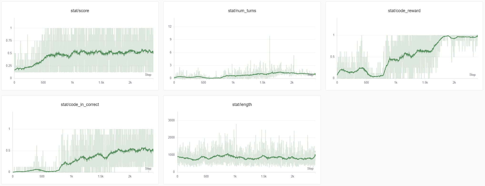

# ZERO TIR RL

This is an example that implements [ZERO-TIR-RL](https://zhuanlan.zhihu.com/p/1889286471078368477) with **AReaL-lite**.

## 🎯 Tool Integrated Reasoning (TIR)

Tool Integrated Reasoning (TIR) refers to enabling LLMs to use external tools during the reasoning process in order to enhance the model's problem-solving and reasoning capabilities.

This project performs GRPO on a base model and enables the model to learn how to use a python-code executor to solve mathematical problems.

## 📋 Prerequisites

Before you begin, ensure you have met the following requirements:

- You have installed **AReaL-lite**. Please follow the official
  [AReaL installation guide](https://inclusionai.github.io/AReaL/tutorial/installation.html).
- You have access to the `Qwen/Qwen2.5-1.5B` model on the Hugging Face Hub (or have it downloaded locally).

## 🚀 Quick Start

### 1. Prepare the Dataset

First, download [orz-57k dataset](https://github.com/Open-Reasoner-Zero/Open-Reasoner-Zero/blob/main/data/orz_math_57k_collected.json) and put it in the `data` directory.

### 2. Launch the Training

Launch the local AReaL training process using the provided configuration on a single node with 2 GPUs.

```bash
python3 -m areal.launcher.local train.py \
    --config train_config.yaml \
    experiment_name=<your experiment name> \
    trial_name=<your trial name> \
    train_dataset.path=data/orz_math_57k_collected.json \
    stats_logger.wandb.mode=online  # Set to 'disabled' if you don't use Weights & Biases
```

To customize the experiment (models, datasets, resources, hyperparameters, etc.) and code execution environment, you can edit the `train_config.yaml` file directly or override the parameters in the command line.

## 🧠 Core Implementation

This example is adapted from the GSM8K example in AReaL, with key modifications:

### Training Workflow (`train.py`)

The `arun_episode` method in `TIRWorkflow` class takes a prompt and generates rollouts for RL training.

```python
from areal.api.workflow_api import RolloutWorkflow
from areal.api.reward_api import AsyncRewardWrapper

class TIRWorkflow(RolloutWorkflow):
    def __init__(
        self,
        config: WorkflowConfig,
        gconfig: GenerationHyperparameters,
        envconfig: EnvironmentConfig,
        tokenizer: PreTrainedTokenizerFast,
    ):
        self.config = config
        self.gconfig = gconfig
        self.envconfig = envconfig
        self.tokenizer = tokenizer
        self.code_env = CodeExecutionToolBox(envconfig)
        self.async_reward_fn = AsyncRewardWrapper(reward_fn)
        self.async_code_exec = AsyncRewardWrapper(execute_code)

    async def collect_agent_trajectory(self, qid, prompt, answer, engine):
        traj_rid = uuid.uuid4().hex  # Unique identifier for the trajectory

        num_turns = 0
        stops = ["```python", "</answer>"]

        # Token IDs, logprobs, and loss mask for RL training
        input_str = prompt
        input_ids = self.tokenizer.encode(input_str, add_special_tokens=False)
        logprobs = [0.0] * len(input_ids)
        loss_mask = [0] * len(input_ids)
        
        while num_turns < self.config.max_turns:
            req = ModelRequest(
                rid=traj_rid,
                input_ids=input_ids,
                gconfig=self.gconfig.new(n_samples=1),
            )
            req.gconfig.stop = stops  # Set stop tokens
            # Limit the total tokens in a trajectory
            if len(input_ids) + self.gconfig.max_new_tokens >= self.config.max_tokens_per_traj:
                break
            
            resp = await engine.agenerate(req)  # Generate model response
            completion_str = self.tokenizer.decode(resp.output_tokens)

            # Record the completion
            input_str += completion_str
            input_ids += resp.output_tokens
            logprobs += resp.output_logprobs
            loss_mask += [1] * len(resp.output_tokens)

            if "</answer>" in completion_str:
                break
            # We meet the start of a code block. Set "```" as stop token
            elif stops[0] == "```python" and "```python" in completion_str:
                stops[0] = "```"
            # We meet the end of a code block.
            elif stops[0] == "```" and "```" in completion_str:
                matches = re.findall(r'```python(.*?)```', input_str, re.DOTALL)
                if matches:
                    code = matches[-1]
                    num_turns += 1
                    execution_output = await self.async_code_exec(self.code_env, code)  # Execute the code

                    # Record the execution completion
                    input_str += execution_output
                    exec_tokens = self.tokenizer.encode(execution_output, add_special_tokens=False)
                    if len(input_ids) + len(exec_tokens) >= self.config.max_tokens_per_traj:
                        exec_tokens = exec_tokens[:self.config.max_tokens_per_traj - len(input_ids) - 1]
                    input_ids += exec_tokens
                    logprobs += [0.0] * len(exec_tokens)
                    loss_mask += [0] * len(exec_tokens)
                stops[0] = "```python"  # Reset stop token to "```python"
            
            if resp.output_tokens[-1] in [self.tokenizer.eos_token_id, self.tokenizer.pad_token_id]:
                break

        extracted, reward = await self.async_reward_fn(input_str, answer=answer)  # Compute reward

        # Convert to TensorDict
        res = dict(
            input_ids=torch.tensor(input_ids),
            logprobs=torch.tensor(logprobs),
            loss_mask=torch.tensor(loss_mask, dtype=torch.bool),
            rewards=torch.tensor(float(reward)),
            attention_mask=torch.ones(len(input_ids), dtype=torch.bool),
        )
        res = {k: v.unsqueeze(0) for k, v in res.items()}
        return TensorDict(res, batch_size=[1])

    async def arun_episode(self, engine, data):
        qid = uuid.uuid4().hex  # Unique identifier for the question

        prompt = self.tokenizer.apply_chat_template(
            [
                {"role": "system", "content": SYSTEM_PROMPT},
                {"role": "user", "content": data["question"]}
            ],
            tokenize=False,
            add_generation_prompt=True,
        )
        prompt += "<think>\n"

        # Collect multiple trajectories for the same question
        trajs = await asyncio.gather(*[
            self.collect_agent_trajectory(qid, prompt, data["answer"], engine)
            for _ in range(self.config.n_trajs)
        ])

        # Compute advantages (GRPO)
        avg_reward = sum([t["rewards"].item() for t in trajs]) / len(trajs)
        if avg_reward == 0:
            return None
        std = (sum([(t["rewards"].item() - avg_reward) ** 2 for t in trajs]) / len(trajs)) ** 0.5
        for traj in trajs:
            traj["rewards"] = (traj["rewards"] - avg_reward) / (std + 1e-6)
        
        return concat_padded_tensors(trajs)
```

### Code Execution Environment (`utils/` directory)

To enable the model to use a python-code executor as a tool, in `utils/code_execution_tool.py` we implement class `CodeExecutionToolBox` as the code execution environment. Its `step` method takes a code string as input and returns the execution result. The implementation is adapted from [Verl-Tool](https://github.com/TIGER-AI-Lab/verl-tool/blob/main/verl_tool/servers/tools/python_code.py).

## 🧪 Experiments



Given one trajectory, `score` records whether the final answer is correct, `length` records the number of tokens in the trajectory, `num_turns` records the number of code execution calls, `code_reward` records whether `num_turns>0`, and `code_in_correct` records whether `num_turns>0` and `score==1` both hold.

This is a sample trajectory generated by the trained model.

````
<|im_start|>system

You are a helpful assistant. The User asks a question, and the Assistant solves it. 
The Assistant first thinks about the reasoning process in the mind and then provides the User with the answer. The reasoning process is enclosed within <think> </think> and answer is enclosed within <answer> </answer> tags, respectively, i.e., <think> reasoning process here </think> <answer> answer here </answer>. And your final answer will be extracted automatically by the \boxed{{}} tag.
In your reasoning-process, You can use python-code to solve your problem. Put the code within ```python and ``` tags. The script will be executed immediately and output will be returned.
Every code block inherits the global state (variables, imports, and definitions) from earlier code blocks.
<|im_end|>
<|im_start|>user
How many different isosceles triangles have integer side lengths and a perimeter of 27?<|im_end|>
<|im_start|>assistant
<think>
To determine the number of different isosceles triangles with integer side lengths and a perimeter of 27, we can follow these steps:

1. Let the two equal sides of the isosceles triangle be \(a\).
2. Let the base of the isosceles triangle be \(b\).
3. The perimeter condition gives us: \(2a + b = 27\).
4. For the sides to form a triangle, they must satisfy the triangle inequality:
   - \(a + a > b\) ⟹ \(2a > b\)
   - \(a + b > a\) ⟹ \(b > 0\) (which is always true for positive side lengths)
   - \(a + b > a\) ⟹ \(b > 0\) (which is always true for positive side lengths)

Using these conditions, we can iterate through possible values of \(a\) and \(b\) to find all valid isosceles triangles.

Let's write the Python code to find all such triangles and count them.
```python
# Initialize a set to store unique isosceles triangles with integer side lengths
isosceles_triangles = set()

# Iterate through possible values of a (side length of the equal sides)
for a in range(1, 27//2 + 1):
    # Calculate the base b using the perimeter condition
    b = 27 - 2 * a
    # Check if b is a positive integer and satisfies the triangle inequality
    if b > 0 and 2 * a > b:
        # Add the triangle to the set (tuple (a, a, b) where b is the base)
        isosceles_triangles.add((a, a, b))

# The number of unique isosceles triangles
num_triangles = len(isosceles_triangles)
print(num_triangles)
```

```output
7


```
<answer>7</answer>
````

## 🤝 Contributing

Contributions to improve this example are welcome! Please feel free to open an issue or
submit a pull request.